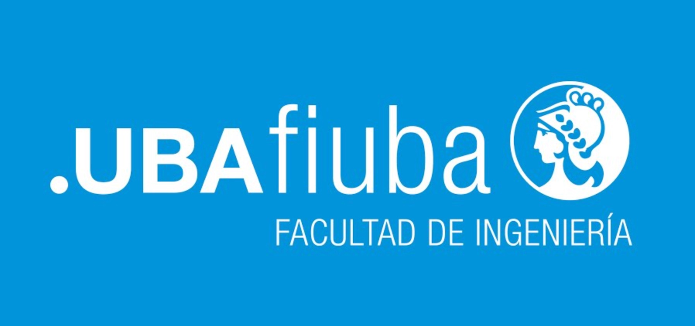

  
# **Universidad de Buenos Aires**  
# **Especialización en Inteligencia Artificial**

## Portafolio de Procesamiento de Lenguaje Natural

**Alumno:** Ing. Nicolas Tertusio

**Profesor:** Dr. Rodrigo Cardenas

---

### Descripción del Repositorio

Este repositorio contiene los desafios realizados durante la materia de Procesamiento de Lenguaje Natural (PLN), parte de la Especialización en Inteligencia Artificial de la Universidad de Buenos Aires. El objetivo de este portafolio es demostrar el conocimiento y las habilidades adquiridas en técnicas de PLN, aplicadas a diferentes problemas y datasets. Cada capítulo corresponde a un desafio especifico que aborda un aspecto clave del procesamiento de lenguaje natural.

### Contenido del Repositorio

#### 1. **Capítulo 1: Vectorización de texto y Modelo Naïve Bayes**  
En este desafío, se aborda la clasificación de texto utilizando el dataset 20 Newsgroups, un conjunto de datos clásico en el campo del Procesamiento de Lenguaje Natural. Este dataset consiste en un conjunto de artículos de noticias categorizados en 20 diferentes grupos de discusión.

**Objetivos**:

 - **Carga de Datos**: Los datos se cargan utilizando la librería sklearn, que ya proporciona el dataset preprocesado y separado en conjuntos de entrenamiento y prueba.
 - **Vectorización**: Se implementa la vectorización de texto usando TfidfVectorizer, una técnica que convierte el texto en una matriz documento-término, donde cada elemento representa la importancia de una palabra en un documento en comparación con el corpus completo.
 - **Clasificación**: Se entrena un modelo de clasificación Naïve Bayes, específicamente MultinomialNB y ComplementNB, para predecir la categoría de noticias a partir de sus representaciones vectorizadas.
 - **Evaluación**: La efectividad del modelo se mide mediante la métrica de F1-score, evaluando así su precisión en la tarea de clasificación.

Este desafío introduce conceptos fundamentales de PLN, como la vectorización de texto y el uso de modelos probabilísticos para la clasificación de documentos.

#### 2. **Capítulo 2: Titulo 2**  
Este desafío tiene como objetivo la creación de embeddings personalizados a partir de un corpus específico utilizando la biblioteca Gensim. Los embeddings son representaciones vectoriales de palabras que capturan su significado en función del contexto en el que aparecen en los textos. Por motivos de copyright no es posible compartir el corpus utilizado, pero se basa en una aventura para el juego de rol Calabozos y Dragones.

Objetivos:

 - **Generación de Embeddings**: Se construyen embeddings personalizados usando la técnica de Word2Vec, un modelo que entrena vectores de palabras en función de su contexto en un corpus de texto.
 - **Preprocesamiento**: El texto es preprocesado para preparar los datos para el entrenamiento, incluyendo la tokenización y la organización del corpus en oraciones o documentos.
 - **Entrenamiento**: Se entrena el modelo Word2Vec para generar embeddings que luego pueden ser utilizados para diversas tareas de PLN, como similitud de palabras, análisis semántico, entre otros.
 - **Evaluación y Visualización**: Se evalúan las relaciones entre palabras utilizando los embeddings generados, y se visualizan los resultados para interpretar las características semánticas capturadas.

Este desafío profundiza en la creación de representaciones vectoriales de palabras, un componente clave en muchas aplicaciones de PLN.

#### 3. **Capítulo 3: Titulo 3**  
   Descripcion 3

#### 4. **Capítulo 4: Titulo 4**  
   Descripcion 4

#### 5. **Capítulo 5: Titulo 5**  
   Descripcion 5

---
